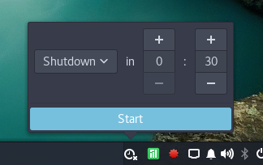
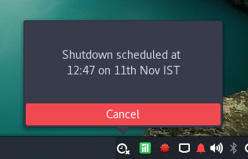

# Budgie Auto Power Widget
Automatically Shutdown/Reboot/Hibernate/Suspend after a set time.

###Notifications

##Installing

Run 'sudo ./install-applet.sh' from the source directory.

#####Written in Python ! ❤

####-Gopikrishnan R (github.com/gkr09)

